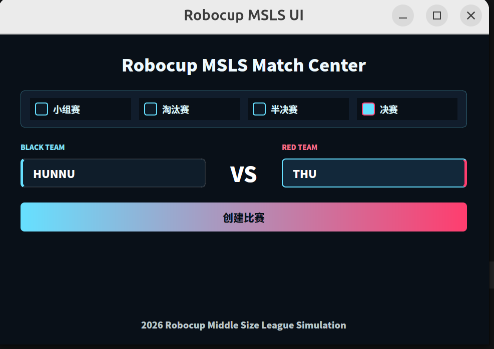

# RoboCup Mid-Size Simulation



本项目基于 ROS 2 Jazzy 和 Gazebo Harmonic，提供 RoboCup 中型组仿真所需的比赛场地、机器人模型、足球模型、Gazebo 插件、ROS/Gazebo 通信桥接及相关控制模块。

## 1. 编译工作空间

在工作空间根目录执行：

```bash
source /opt/ros/jazzy/setup.bash
colcon build --symlink-install
```

编译完成后加载工作空间环境：

```bash
source install/setup.bash
```

修改 launch 文件、Python 节点或配置文件后，建议重新执行编译命令。

## 2. 启动比赛场地

项目提供两套 Gazebo 启动文件：

| 启动模式 | Launch 文件 | 渲染器 | 使用场景 |
| --- | --- | --- | --- |
| GPU 模式（默认） | `load_world_gpu.launch.py` | Ogre2 | 正常支持 GPU/OpenGL 渲染的设备 |
| CPU/兼容模式 | `load_world_cpu.launch.py` | Ogre 1.x | Ogre2 无法渲染、Shader 编译失败或 Gazebo 闪退时 |

### 2.1 默认启动：GPU 模式

正常情况下优先使用 GPU 模式：

```bash
source install/setup.bash
ros2 launch nubot_gazebo load_world_gpu.launch.py
```

也可以使用项目根目录下的简化脚本。未指定模式时，脚本默认启动 GPU 版本：

```bash
source gameReady.sh
```

以下写法与默认启动等价：

```bash
source gameReady.sh gpu
```

GPU 启动文件会显式使用 Gazebo 默认的 Ogre2 渲染后端：

```text
--render-engine ogre2
```

### 2.2 GPU 渲染失败：切换 CPU/兼容模式

如果 GPU 模式无法显示场景、Gazebo 窗口打开后立即关闭，或者终端中出现 Ogre2 Shader 编译错误，请先使用 `Ctrl+C` 结束当前进程，然后启动 CPU/兼容版本：

```bash
source install/setup.bash
ros2 launch nubot_gazebo load_world_cpu.launch.py
```

使用简化脚本时执行：

```bash
source gameReady.sh cpu
```

CPU/兼容启动文件默认使用 Ogre 1.x：

```text
--render-engine ogre
```

该模式主要用于规避部分 ARM64 虚拟机、virgl/Mesa 虚拟显卡或 OpenGL 驱动环境中的 Ogre2 兼容问题。兼容模式的渲染性能和部分视觉效果可能低于 Ogre2，但通常具有更好的环境兼容性。

## 3. Ogre2 闪退故障判断

如果 GPU 模式启动后出现以下日志，通常表示 Ogre2 无法在当前图形环境中编译 GLSL Shader：

```text
Ogre::RenderingAPIException
Fragment Program 100000000PixelShader_ps failed to compile
GLSL compile log: 100000000PixelShader_ps
```

也可能看到类似错误：

```text
error: no matching function for call to `texelFetch(...)`
terminate called after throwing an instance of 'Ogre::RenderingAPIException'
Aborted
```

此时不需要修改世界文件或机器人模型，直接切换到 CPU/兼容启动文件：

```bash
source gameReady.sh cpu
```

以下警告通常不是本次闪退的直接原因：

```text
Binding loop detected
Trying to serialize component
Trying to deserialize component
Gazebo does not support Ogre material scripts
```

## 4. 确认当前渲染器

启动时可以通过终端日志确认 Gazebo 实际加载的渲染器。

GPU/Ogre2 模式：

```text
Loading plugin [gz-rendering-ogre2]
```

CPU/兼容模式：

```text
Loading plugin [gz-rendering-ogre]
```

两个 launch 文件都通过 Gazebo 的 `--render-engine` 命令行参数指定渲染器，因此会覆盖 `~/.gz/sim/8/gui.config` 中保存的 `<engine>` 值。一般不需要手动修改用户目录下的 Gazebo GUI 配置。

## 5. 推荐启动流程

```text
开始
  |
  v
启动 GPU 模式（默认）
  |
  +-- 正常渲染 -----------------> 使用 GPU 模式
  |
  +-- 黑屏 / 闪退 / Shader 错误 -> Ctrl+C 停止
                                    |
                                    v
                              启动 CPU/兼容模式
```

对应命令：

```bash
# 第一次启动，默认使用 GPU/Ogre2
source gameReady.sh

# 如果 GPU/Ogre2 报错，改用 CPU/Ogre1 兼容模式
source gameReady.sh cpu
```

## 6. 项目目录说明

```text
src/
├── gazebo_visual/       # Gazebo 世界、模型和仿真插件
├── robot_code/          # 机器人接口、公共库和控制节点
├── auto_referee/        # 自动裁判模块
├── tools/               # 辅助工具
└── py_scripts/          # Python 辅助脚本
```

主要模块包括：

- `nubot_interfaces`：ROS 2 消息和服务接口。
- `nubot_common`：公共数据结构、几何工具和基础库。
- `nubot_description`：机器人、足球、网格和纹理资源。
- `nubot_gazebo`：Gazebo 世界启动与 ROS/Gazebo Bridge 配置。
- `nubot_plugin`：Gazebo System 插件。
- `nubot_hwcontroller`：机器人硬件控制与仿真控制适配。
- `auto_referee`：比赛控制和自动裁判模块。

## 7. 注意事项

`gazebo_visual` 包含比赛场地、足球模型、机器人模型及 Gazebo 仿真平台。比赛选手不应随意修改比赛场地和官方模型，最终比赛环境以赛事提供的版本为准。
